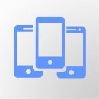

# ios-xcode-webapp-startup-
XCode Objective-C start up project, that allows you to create an ios webview application.

It comes packaged with: 
- web url filter detection
- custom configuration file for web url, colors, etc...
- configurable splash image
- progress indicator when loading in new pages
- camera upload support
- simple cache management

Real use case apps currently using this build: 
[Aerial Video Awards iOS](https://linkmaker.itunes.apple.com/en-us/details/1360880208) 
[Bookme NZ iOS](https://linkmaker.itunes.apple.com/en-us/details/1435862603) 

There is also an Android Studio startup project as well, see here: 
[android-webapp-startup](https://github.com/lavoe2k/android-webapp-startup) 

## Prerequisites

#### You need a Mac ;-)

#### XCode

Before you can start, you need to have XCode 9.0.0 or greater installed on your machine. 
To download visit https://developer.apple.com/xcode/

#### Apple Developer License
This might seem obvious but you will need a Apple Developer License in order to make a final build and publish. With the license you can create your app and application id which you will need when you configure the app's project manifest and build script file. 
For more information visit https://developer.apple.com/programs/

___

